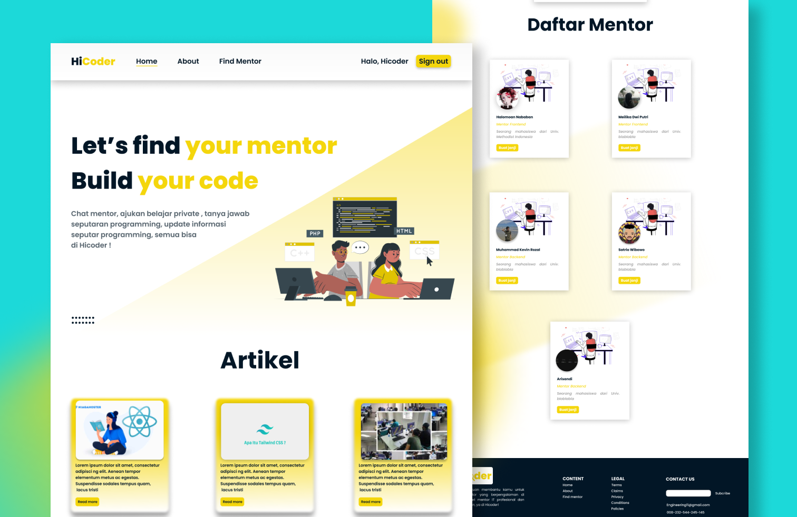

<!-- PROJECT LOGO -->
<br />
<p align="center">
  <a href="https://github.com/rg-km/final-project-engineering-11">
    
  </a>

  <h3 align="center">We Find The Best Mentor!</h3>

  <p align="center">
    <strong>Hicoder</strong> akan membantu anda untuk mencari mentor yang berpengalaman di bidang IT. Anda akan dibimbing secara profesional dengan materi yang ter-update dan sesuai dengan kebutuhan perusahaan-perusahaan saat ini. Anda juga bisa menyampaikan pertanyaan dan melakukan konsultasi terkait kesulitan anda saat mempelajari materi atau mengerjakan project anda. Let's try with us.
    <br />
    <a href="https://docs.google.com/presentation/d/1gl5Y4_LcaktFQTIMxvrBk1Ji3nig2rlRClDWS-5CDMM/edit?usp=sharing"><strong>Explore the docs »</strong></a>
    <br />
    <br />
    <!-- <a href="">View Demo</a>
    ·
    <a href="">Report Bug</a>
    ·
    <a href="">Request Feature</a> -->
  </p>
</p>


<!-- TABLE OF CONTENTS -->
## Table of Contents

* [About the Project](#about-the-project)
  * [Built With](#built-with)
* [Getting Started](#getting-started)
* [License](#license)
* [Acknowledgements](#acknowledgements)


<!-- ABOUT THE PROJECT -->
## About The Project

    <br />

Fitur - Fitur HiCoder:
* Main menu adalah page yang menampilkan face of project yang telah disesuaikan untuk menggiring ekspektasi user ketika mengakses website HiCoder. Pada menu ini, user dapat melihat Content Artikel yang telah kami sediakan.
* About adalah page yang menampilkan informasi tentang website HiCoder, dan juga menampilkan Biodata Singkat kami para developer HiCoder.
* Finmentor adalah page yang menampilkan daftar mentor yang telah kami sediakan. User juga dapat melakukan booking mentor dengan Mengklik button Buat Janji.
* Profile adalah page yang menampilkan profil user yang telah login, dan juga menampilkan Status booking mentor. User juga dapat melakukan edit profil dan melakukan logout.


### Built With
This section should list any major frameworks that you built your project using. Leave any add-ons/plugins for the acknowledgements section. Here are a few examples.
* [React js](https://reactjs.org/)
* [Golang](https://go.dev/)
* [Tailwind CSS](https://tailwindcss.com/)
* [Axios](https://axios-http.com/docs/intro)


<!-- GETTING STARTED -->
## Getting Started [Bash]
1. Clone the repo
```sh
git@github.com:rg-km/final-project-engineering-11.git
```
3. Go to frontend
```sh
cd frontend/
```
4. Install NPM packages
```sh
npm install
```
5. Starting
```JS
npm start
```


<!-- LICENSE -->
## License

Distributed under the Ruangguru License. See `LICENSE` for more information.
Project Link: [https://github.com/rg-km/final-project-engineering-11]


<!-- ACKNOWLEDGEMENTS -->
## Acknowledgements
* [GitHub Emoji Cheat Sheet](https://www.webpagefx.com/tools/emoji-cheat-sheet)
* [Img Shields](https://shields.io)
* [Choose an Open Source License](https://choosealicense.com)
* [GitHub Pages](https://pages.github.com)
* [Animate.css](https://daneden.github.io/animate.css)
* [Loaders.css](https://connoratherton.com/loaders)
* [Slick Carousel](https://kenwheeler.github.io/slick)
* [Smooth Scroll](https://github.com/cferdinandi/smooth-scroll)
* [Sticky Kit](http://leafo.net/sticky-kit)
* [JVectorMap](http://jvectormap.com)
* [Font Awesome](https://fontawesome.com)


## Our Team

<link rel="stylesheet" href="https://cdnjs.cloudflare.com/ajax/libs/font-awesome/4.7.0/css/font-awesome.min.css">

<table>
    <tr>
        <td align="center"><a href="">
        <br />
        <sub><b>Halomoan Nababan</b></sub></a><br/><a href="https://twitter.com/oan_hihi" class="fa fa-twitter"></a></a>&nbsp;&nbsp;<a href="https://www.linkedin.com/in/halomoan-tech/" class="fa fa-linkedin"></a>&nbsp;&nbsp;<a href="https://github.com/hioan-dev" class="fa fa-github"></a>
        </td>        
        <td align="center"><a href="">
        <br />
        <sub><b>Meilika Dwi Putri</b></sub></a><br/><a href="https://github.com/Meilika" class="fa fa-github"></a>
        </td>             
        </td>        
        <td align="center"><a href="">
        <br />
        <sub><b>Muhammad Kevin Rozal</b></sub></a><br/><a href="https://github.com/kvnrzl" class="fa fa-github"></a>
        </td>             
        </td>        
        <td align="center"><a href="">
        <br />
        <sub><b>Satrio Wibowo</b></sub></a><br/><a href="https://github.com/satriowibowo1701" class="fa fa-github"></a>
        </td>             
        </td>        
        <td align="center"><a href="">
        <br />
        <sub><b>Arisandi</b></sub></a><br/><a href="https://github.com/arisandi1" class="fa fa-github"></a>
        </td>             
    </tr>
</table>